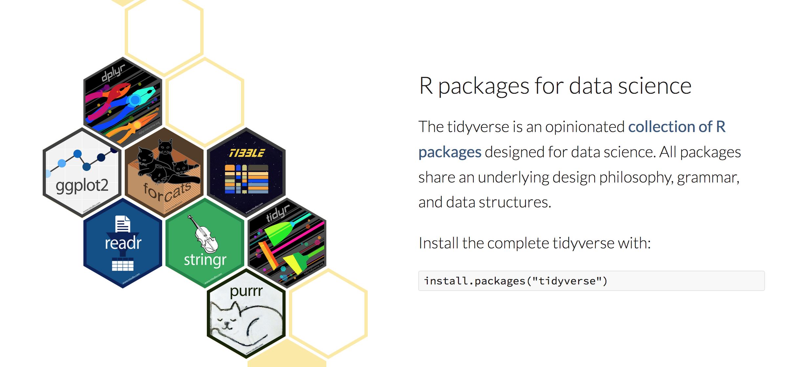

```{r setup, include=FALSE}
knitr::opts_chunk$set(echo = TRUE)
```

## What is the Tidyverse?



In practice, when people talk about "Tidy" code, they are usually referring to a modern style of coding in R where functions are strung together using "pipes" ( `%>%` ) into a pipeline of commands that performs a task or creates an object. Folks might also being referring to the use of "verbs" from the `dplyr` package that are useful for data cleaning, summarizing, exploring, etc. 

Formally, the "Tidyverse" is a collection of packages, developed by the same folks as RStudio, that each focus on specific types of tasks, like reading in data files, dealing with string or dates, iterating through groups, etc. There are TONS of good resources online, and this lesson borrows heavily from [R for Data Science](https://r4ds.had.co.nz/index.html) by Hadley Wickham and Garrett Grolemund. 

## Install and load packages

Today we'll focus mainly on data cleaning/wrangling/carpentry/tidying (data science folks like to coin new words...), which relies on several Tidyverse packages, so I find it easiest to just load the entire Tidyverse at once. If you haven't already installed tidyverse, do so: `install.packages('tidyverse')`. 


```{r load}
# Then load the packages. Tidyverse is unusual because it loads multiple packages with one command:
library(tidyverse)

# You could also load individual packages, for example:
library(dplyr)
library(ggplot2)

```

## Conventional coding

Let's start with a very simple example. In conventional R coding, we often do something like this:
```{r conventional_1}
set.seed(1234) # This just ensures we generate the same random numbers

n_nums <- 100
random_nums <- rnorm(n_nums, mean = 0, sd = 1)
rand_mean <- mean(random_nums)
mean_pi <- rand_mean*pi
converted_mean <- mean_pi/100
converted_mean

```


Or, to condense this:
```{r conventional_2}
set.seed(1234) # This just ensures we generate the same random numbers

converted_mean <- (mean(rnorm(100, mean = 0, sd = 1))*pi)/100
converted_mean

```

These styles of coding can quickly become confusing. It makes your code error-prone, harder to debug, and harder for your collaborators (including you in 6 months) to understand. 

## Tidy coding with the pipe

The alternative is to use the 'pipe' ( `%>%` ), which is the foundation of the tidy style of coding. With pipes, we string together functions into a "paragraph" that is easier to read and understand.

The pipe was developed independently of the Tidyverse, in the `magrittr` package (a play on pipe in Spanish) by Stefan Milton Bache. It has been adopted by the Tidyverse, and is loaded automatically. Piping can also use less memory than creating multiple objects (this isn't a huge deal at this point, and I'm not going to demonstrate it, but it can become important with large datasets). 

```{r pipes_1}
set.seed(1234) # This just ensures we generate the same random numbers

converted_mean <- 100 %>% 
  rnorm(., mean = 0, sd = 1) %>% # The dot here refers to the result of the previous statement.
  mean(.) %>%  # We can also leave the dot out, but it is more explicit to use it.
  `*`(pi) %>% # Arithmetic operations must be put in ticks (``) and numbers in parentheses.
  `/`(100)

converted_mean

```
We can read this like a sentence, replacing the pipes with "then": "To create the object 'Converted mean' take number 100, THEN generate a randon normal distribution with 100 values, THEN calculate the mean, THEN multiply by pi, THEN divide by 100." It's really easy to see the steps and their order. 

Arithemtic operations are a little clunky with pipes, and not something we would do very often. Instead we might do this:
```{r pipes_2}
convert_fun <- function(x) (x*pi)/100

set.seed(1234) 

converted_mean <- 100 %>% 
  rnorm(., mean = 0, sd = 1) %>% 
  mean() %>%  
  convert_fun()

converted_mean

```

But the pipe isn't for everything! I sometimes find myself stringing together a dozen or so functions, and then realize I've lost the plot. It's still OK to make intermediate objects!


## Example workflow with real data

Ok, those examples are a bit too trivial to be convincing. Let's use the Snotel data to see how we might actually use this type of coding style.

There are a lot of philosophies and opinions when it comes to storing and accessing data, but let's not get into that. For now, let's just assume we are keeping a .csv file of our data in the same directory as our script. 

`read_csv` works a lot like `read.csv`, except it's more 'opinionated', automaticaly turns your dataframe into a 'tibble', and has some other differences we don't need to explore yet. Tibbles are the tidy version of dataframes and work very similarly (again, don't worry about the details for now). I always start by taking a look at the first few rows of data and making sure things look the way I intended. Tibbles display in a succint way that doesn't require using the `head()` function, which I love.

```{r snotel_read}
snotel_df <- read_csv('tahoe_snotel_data.csv')
snotel_df

```

## Introducing `dplyr` verbs

Now let's explore some of the "verbs" from the `dplyr` package that can be super useful for cleaning and exploring data. 

The main verbs are:

`filter()`: Filter observations (rows) by their values 

`arrange()`: Arrange the rows; use with `desc()` 

`select()`: Select variables (columns) by their names 

`mutate()`: Create new variables with functions of existing variables 

`summarise()`: Summarise many values down to a single statistic 

All of these verbs can be used with `group_by`, which performs the same operation on grouped subsets of the data.

Let's start with `filter`. Let's filter out data from the 'TAHOE CITY CROSS' station.
```{r snotel_filter_1}
snotel_df %>% 
  filter(site == 'TAHOE CITY CROSS') 
```


There's some basic, but useful, stuff we might do before we even proceed to analyze these data. We could use `arrange()` to learn more about the data. 
```{r snotel_arrange}
snotel_df %>% 
  filter(site == 'TAHOE CITY CROSS') %>% 
  arrange(tavg) # The coldest observations are from Jan '97 and Dec '98

snotel_df %>% 
  filter(site == 'TAHOE CITY CROSS') %>% 
  arrange(desc(tavg)) # The warmest observations are from July '02

```


We can use the helper function `tally()` to count observations.
```{r snotel_tally}
# How many observations do we have from this site?
snotel_df %>% 
  filter(site == 'TAHOE CITY CROSS') %>% 
  tally()
```


Let's keep moving through the verbs to get familiar with them. `select()` is used to pick out variables/columns, and can also be used to reorder the variables in the dataframe (which is useful if you want to create a table or if you're just particular about how your data are organized, like me). In this dataframe, the 'dates' column is redundant, so we could drop it using `select(., -dates)`. We could also reorganize the data and drop it at the same time. Let's actually create a new object that is our simplified dataframe to use moving forward. Notice that previously we weren't creating objects at all, just printing output of manipulations of our dataframe.
```{r snotel_select}
snotel_small_df <- snotel_df %>% 
  select(year, month, doy, site, elev, tavg) 

snotel_small_df
```


Next let's look at `mutate()`. I use this verb constantly. It creates new columns based on the existing columns. I use this to create dummy variables that are conditional on other columns, convert a column into new units, etc. Let's look at a few examples.
```{r snotel_mutate}
# A new column as an exisitng column in a new unit
snotel_small_df %>% 
  mutate(elev_ft = elev*3.28)

# A new column that is a dummy/indicator/flag based on conditions of another 
# variable. 
# This could be useful if we wanted to color points in a plot based on whether 
# they're above or below a threshold, for example. 
# Here I'll use the `ifelse()` function to do it. 
# There's a dplyr version, `if_else` that is more opinionated and often fails 
# for me, but is probably safer.
snotel_small_df %>% 
  mutate(subalpine = ifelse(elev > 2500, 'Yes', 'No')) 

# There's another way to do this using the `case_when` function. 
# This is more flexible and better for more complex statements.
snotel_small_df <- snotel_small_df %>% 
  mutate(forest_type = case_when(elev > 2500 ~ 'Subalpine',
                                 between(elev, 2000, 2500) ~ 'Mixed',
                                 elev < 2000 ~ 'Montane'))
snotel_small_df

```


## Summarizing data

Ok, let's get into some more involved tasks, and learn about `summarize()` and `group_by` in the process. We can tackle each of the tasks from your first assignment.

### 1. Summarize the data by monthly normals (means) for each site.
```{r snotel_summarize}
snotel_small_df %>% 
  group_by(site, month) %>% 
  # Note the use of `na.rm = T` because some values are missing... 
  # Consider if that's appropriate before proceeding.
  summarize(month_mean = mean(tavg, na.rm = T)) 
```

### 2a. Produce univariate summary statistics for the data. 
We can include as many different summary statistics as we want.
```{r snotel_summarize_2}
snotel_small_df %>% 
  group_by(site, month) %>% 
  summarize(month_mean = mean(tavg, na.rm = T),
            month_stdev = sd(tavg, na.rm = T)) 
```

If we used `mutate()` instead, the same statistics would be calculated over the same groups, but all of the observations would be preserved. Members of the same group will share values. This could come in handy in certain contexts.
```{r snotel_summarize_3}
snotel_small_df %>% 
  group_by(site, month) %>% 
  mutate(month_mean = mean(tavg, na.rm = T),
         month_stdev = sd(tavg, na.rm = T)) %>% 
  arrange(site, month)
```


I want to show a more advanced way to use `summarize`, with another function `across()`. This approach is useful when we want to calculate multiple summary statistics at once, summarize multiple columns, or both. 
```{r snotel_across}

# Here's a named list of summary statistics 
summary_stats <- list(
  med = ~median(.x, na.rm = TRUE),
  mean = ~mean(.x, na.rm = TRUE),
  sd = ~sd(.x, na.rm = TRUE),
  iqr = ~IQR(.x, na.rm = TRUE)
  )

# Now run those stats across the tavg column. 
# We use this special '.names' argument to specify how the new columns should be named.
snotel_small_df %>% 
  group_by(site, month) %>% 
  summarise(across(tavg, summary_stats, .names = "{fn}_{col}"))

# We could do this for multiple columns at once. 
# This isn't a realistic example, but there is only one response variable in this dataframe (tavg) so it's just an example. 
snotel_small_df %>% 
  group_by(site, month) %>% 
  summarise(across(c(elev, tavg), summary_stats, .names = "{fn}_{col}"))

# We can also mix and match these tools. 
snotel_small_df %>% 
  group_by(site, month) %>% 
  summarise(across(tavg, summary_stats, .names = "{fn}_{col}"),
            mean_elev = mean(elev))
   
```

## Fitting models across groups

The Tidyverse has some powerful tools for repeating tasks, mostly from the `purrr` package. If you haven't work with for loops yet, this might be a bit of a jump, but I believe in you! The idea behind any version of iteration in R (for loops, apply, purrr) is to iterate (repeat) a function over every element of a list. Remember that dataframes are just a group of lists that are the same length.

### 3. Fit a linear model that relates the average temperature in May to elevation using data from the 16 sites. Do the same for average temperatures in December. 

There are a lot of ways to tackle this. They all involve creating a functioning and applying it to subsets (by month) of our data. This way uses the `group_map` function, which maps (applies) a function to all groups. 
```{r snotel_groupfun}

fit_lapse <- function(month_df){
  lm_lapse <- lm(tavg_norm ~ elev, data = month_df)
  lapse_rate <- lm_lapse$coefficients['elev']
  return(lapse_rate)
}

snotel_small_df %>% 
  # First calculate the average temps by month, at every elevation (site)
  group_by(month, elev) %>% 
  summarise(tavg_norm = mean(tavg, na.rm = T)) %>% 
  # Then map our function across the groups
  group_map(~ fit_lapse(.))
```

The `broom` packages has some handy built-in tools for linear models (and other commonly used statistical tools) that can make this even simpler. 
```{r snotel_broom}
snotel_small_df %>% 
  # First calculate the average temps by month, at every elevation (site)
  group_by(month, elev) %>% 
  summarise(tavg_norm = mean(tavg, na.rm = T)) %>%
  # Use `broom::tidy` around `lm` to tidy up the output of the linear model
  # This returns a list of tibbles... which is not that convenient actually
  group_map(~ broom::tidy(lm(tavg_norm ~ elev, data = .x))) 

# This version returns a restructured tibble, which is easier to digest!
snotel_small_df %>% 
  # First calculate the average temps by month, at every elevation (site)
  group_by(month, elev) %>% 
  summarise(tavg_norm = mean(tavg, na.rm = T)) %>%
  # Use `broom::tidy` around `lm` to tidy up the output of the linear model
  group_modify(~ broom::tidy(lm(tavg_norm ~ elev, data = .x)))


# We can then do some manipulation of this to highlight the information we're
# most interested in.
snotel_small_df %>% 
  # First calculate the average temps by month, at every elevation (site)
  group_by(month, elev) %>% 
  summarise(tavg_norm = mean(tavg, na.rm = T)) %>%
  # After using summarize, the last group gets dropped, now just month
  # Use `broom::tidy` around `lm` to tidy up the output of the linear model
  group_modify(~ broom::tidy(lm(tavg_norm ~ elev, data = .x))) %>% 
  filter(term == 'elev', month %in% c('May','December')) %>% 
  mutate(lapse_rate = round(estimate*1000, 2)) %>% 
  select(month, lapse_rate)

# The function `glance` is similar to `tidy`, but provides different info:
snotel_small_df %>% 
  group_by(month, elev) %>% 
  summarise(tavg_norm = mean(tavg, na.rm = T)) %>%
  # Use `broom::glance` around `lm` to tidy up the output of the linear model
  group_modify(~ broom::glance(lm(tavg_norm ~ elev, data = .x)))
```


## Extra Credit Challenge! 

Ok, let's try to tackle this extra credit challenge. Here, Solomon is asking for some specific information, which we can pull out and compile with one custom function. We could also use a combination of the things we did with `broom`, I'll let you figure that out. Here's the approach that I would take, because it provides a bit more control:
```{r snotel_map}
# First we need to build our function. This can take some trial and error.
# For this to work correctly, the function should return a dataframe/tibble.
# Solomon asked for: month, lapse rate, and r2

fit_lapse <- function(data){
  # Fit the linear model
  lm_lapse <- lm(tavg_norm ~ elev, data = data)
  # Save the results as a data.frame
  result <- data.frame('lapse_rate' = round(lm_lapse$coefficients['elev']*1000,2),
                       'r2' = round(summary(lm_lapse)$r.squared, 2),
                       'intercept' = round(lm_lapse$coefficients['(Intercept)']))
  # Return the data.frame
  return(result)
}

# First we still need to summarize the data by month
month_norm_df <- snotel_small_df %>% 
  group_by(month, elev) %>% 
  summarise(tavg_norm = mean(tavg, na.rm = T)) 

lapse_model_df <- month_norm_df %>% 
  group_by(month) %>% 
  group_modify(~ fit_lapse(.x))

lapse_model_df

```


## ggplot

A very popular package in the Tidyverse is `ggplot`. It's a powerful set of tools for creating plots that uses the "grammar of graphics". I don't really know what that means, but ggplot does follow some pretty consistent rules. It treats rows as observations and columns as variables. The plot "aesthetics" are defined by different variables. Different "geometries" can be used to plot observations. Let's tackle the assignment again.

### 2b. Produce univariate plots characterizing the data.
```{r snotel_ggplot_1}

# Pretty easy!
ggplot(snotel_small_df) +
  geom_histogram(aes(x = tavg))


# It get's more complicated quickly...
ggplot(snotel_small_df) +
  geom_histogram(aes(x = tavg), fill = 'grey15', color = 'grey40') +
  labs(x = 'Elev.', y = 'Temp.') +
  theme_bw()

# To answer the question, we really want to use facet_wrap, 
# which is like group_by() for plots.
ggplot(snotel_small_df) +
  geom_histogram(aes(x = tavg), fill = 'grey15', color = 'grey40') +
  facet_wrap(~month) +
  labs(x = 'Elev.', y = 'Temp.') +
  theme_bw()


ggplot(snotel_small_df) +
  geom_histogram(aes(x = tavg), fill = 'grey15', color = 'grey40') +
  facet_wrap(~site) +
  labs(x = 'Elev.', y = 'Temp.') +
  theme_bw()

```


ggplot can also call on useful functions to calculate statistics 'under the hood'. `geom_smooth` is especially useful for plotting linear models. We can get waaaay into the weeds of labels, colors pallettes, etc., but this is just a simple example. Google is great!
```{r snotel_ggplot2}

ggplot(month_norm_df, aes(x = elev, y = tavg_norm, color = month)) +
  geom_point() +
  geom_smooth(method = 'lm') +
  labs(x = 'Temperature', y = 'Count') +
  theme_bw()

ggplot(month_norm_df, aes(x = elev, y = tavg_norm, color = month)) +
  geom_point() +
  geom_smooth(method = 'lm') +
  geom_label(data = lapse_model_df, 
             aes(x = min(month_norm_df$elev)+200, 
                 y = min(month_norm_df$tavg_norm)+5, 
                 label = paste('LR =',lapse_rate,'\n', 'R2=',r2)),
             size = 3) +
  facet_wrap(~month) +
  labs(x = 'Elevation', y = 'Temperature') +
  theme_bw()
```

What about the diagnostic plots? There's some complicated ideas here you might check out: [https://rpubs.com/therimalaya/43190](https://rpubs.com/therimalaya/43190). Here's a way following the logic we already presented, using the base R functionality of calling `plot()` on a linear model object.
```{r snotel_diagnostic}
month_norm_df %>% 
  group_by(month) %>% 
  group_map(~ lm(tavg_norm ~ elev, data = .x)) %>% 
  # At this point we have a list of linear models
  # walk is like map, or modify, but is used when we don't need an object, 
  # we just a side-effect
  walk(., function(x){ 
    par(mfrow = c(2,2))
    plot(x)
  })
```
